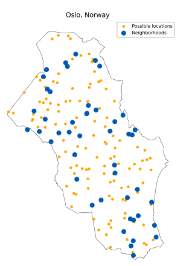
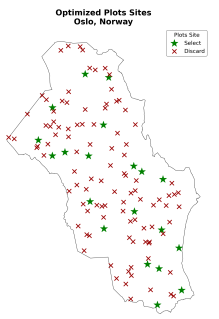
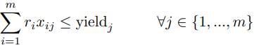

# Urban Gardens

## 1 Introduction
Community shared urban gardens are collaborative
spaces where individuals from a community can come
together to cultivate and maintain gardens within urban areas.  
These gardens provide a shared space for growing fruits, vegetables, herbs, and flowers. 
Urban gardening promotes sustainability as they allow communities to produce their own food locally, reducing the need to transport food for long distances. It improves health as gardening is proved to be a good way of exercising and improving mental health, also they give access to healthy fresh produce to consume
promoting a healthier diet.  
Community shared urban growing gardens provide a space for community members to come together and work towards a common goal.  
In an urbanized world, community gardens connect urban residents and constitute spaces for a commons management of urban resources.  
Urban gardening also have many environmental benefits, it decreases some pollution caused by food transportation, it combats the urban heat island effect by absorbing sunlight and providing shades, and decreases water runoff by absorbing rainfall.   
These gardens can also be an opportunity to educate people on food production and
consumption, while transforming unused urban spaces into beautiful green areas.
There are however some challenges that have to be considered like water resource availability or sunlight and weather conditions. But the main one is the limited amount of land available for this use inside of a city. This last challenge is the one this project focuses on.   
The aim of this project was to build an Artificial Intelligence tool capable of
choosing the best plots of land to be used for urban gardening whilst minimising the necessary amount of land area used. It also must satisfy a minimal produce goal
and minimize the distance of the plots to the assigned community.   
To do so it will take into account the city size, population and geographical location. The idea is that this tool could be used by a city government to help plan and optimize the construction of many urban gardens inside of a city.  
In addition it create a list of plants which are best considering the geographic
location.

## 2 Model

To solve this problem a model to optimize is needed. 
The idea is to do so as a constraint satisfaction model. 
Firstly we assume that each city has a certain number of plots that are available to be chosen for this purpose, each one of these in a different location and of different sizes.   
For this project these are randomly generated, however the idea is that in a real application a city government draws up a list of plots with location and size.  
This is also the case for the neighborhoods, in which case the number of neighborhoods generated depends on the city land size and the number of people in each neighborhoods depends on the city population.   
Taking for example the city of OSLO 45 different neighborhoods and 122 possible plots were generated.   

 

Finally a produce goal is set, this will be a percentage
of the yearly quantity of vegetables consumed by each
community from their assigned plots of land. For every city a different yield per square meter is computed
to obtain the land area needed for the urban gardens.  
In addition to finding the least number of plots to be
assigned, another goal was also to create a program
that would offer residents reliable guidance for choosing
the best vegetables to plant for their areas, considering
the climatic conditions of the previous year.  The first
step was to create a database of plants, where some of
their characteristics like average yield are present, from
which we will choose the most suitable plants for the selected city.  The focus was on day-by-day temperature,
which we used to calculate an approximate monthly average. Based on this information, the optimal growth
temperatures for each species was considered and the
plants best suited to those the specific climatic conditions were selected. However there are many other
variables to consider in agriculture, and climate is only
one factor influencing crop success, but this can be a
good starting point to improve.   For example a future
improvement could be to implement another artificial
intelligence system to monitor the plant’s health and
pathologies through various sensors and computer vision to recognize signs of disease or nutrient deficiencies.  

 
Finally the constraints can be discussed. Firstly every
neighborhood must access only 1 plot:

 Where xij = 1 if and only if the neighborhood i is
connected to plot j.  Another constraint is that the
demand of each neighborhood assigned to plot j must
be lower than it’s yield:

 Every neighborhood must also be connected only to an
activated (chosen) plot: 

 
Where yj = 1 when the plot j is selected.  The objective
function to be optimized is then written as follows: 

 Where dj is the size of plot j and cij is the cost associated with the distance between neighborhood i and
plot j.   This was all implemented in a python script,
the output of which can be seen in the Figure 2 where,
for the example of Oslo, only 20 plots were needed and
chosen from the 122 possible. The final assignment of
each plot to every neighbor is shown below. 

## Conclusion

In conclusion our AI tool was able to select the best
plots of land to be used as a community shared urban
garden and give the best assignments to every neighbor
given the selected constraints.  The optimization of the
objective function was carried out in a python script
written in a joint effort of our team members.  This
tool was tested with 6 different cities (Padua, Naples,
Oslo, Montreal, Sao Paolo, Singapore) with success.  
An advantage of this solution is that it is highly customizable to fit the different use cases, just changing
the average yield per square meter can give highly different results, so it could for example be updated yearly
with the statistic gathered the previous year to better
learn the real possibilities of urban gardening. The
code and other result images are left in the repository
for the reader.  
For sure the code and the functions could be improved a lot, this was an interesting school project that we had to submit within 3-days. If you want, feel free to take the code, edit it and use it as you prefere :)

## Developers
- Davide Delrio
- [Stefano Trenti](https://github.com/TrentiStefano)
- [Matteo Villani](https://github.com/Mattolo4?tab=repositories)
